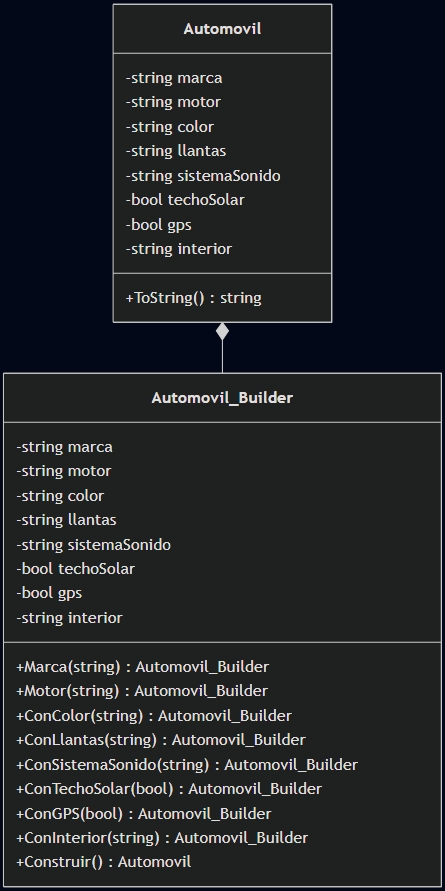
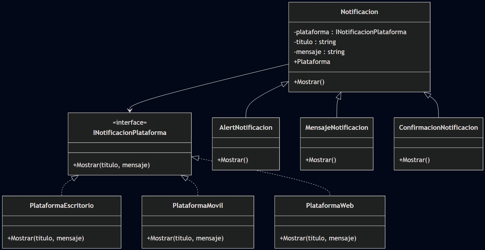

README 

Justificación - Escenario 1 (Automóvil)

Tipo: Creacional
Patrón seleccionado: Builder

En este escenario el reto real no es “crear un carro”, sino construir un objeto complejo con muchas opciones sin caer en el constructor telescópico (demasiados parámetros) ni en una cascada de constructores sobrecargados que terminan siendo difíciles de leer y mantener. Por eso se eligió Builder, porque permite armar el Automóvil paso a paso, agregando solo lo que el cliente necesita (motor, color, llantas, GPS, etc.) y manteniendo el código claro.

Además, el enfoque encaja con los beneficios esperados: mejora la legibilidad (se entiende qué se está configurando), permite omitir opcionales sin crear subclases y mantiene separada la construcción del objeto (en el builder) del objeto final. En el código esto se refleja con Automovil.Builder y métodos encadenados (estilo fluent), y al final se construye un Automovil con sus propiedades definidas desde el constructor, evitando cambios arbitrarios después de creado.

  
  
<i>Diagrama Clases Escenario 1</i>

Justificación – Escenario 2 (Notificaciones por plataforma)

Tipo: Estructural
Patrón seleccionado: Bridge (Puente)

El problema principal es la “explosión combinatoria”: si se combina por herencia el tipo de notificación (mensaje, alerta, advertencia, confirmación) con la plataforma (web, móvil, escritorio), rápidamente se termina con clases como NotificacionMensajeWeb, NotificacionAlertaMovil, etc., y el crecimiento se vuelve difícil de sostener.

Por eso se selecciona Bridge, porque separa dos dimensiones que cambian por motivos distintos:

Notificación: qué se quiere comunicar (mensaje, alerta, etc.).

Plataforma: cómo se presenta (web, móvil, escritorio).

En la solución se evidencia esa separación: Notificacion actúa como abstracción y recibe una INotificacionPlataforma (el implementador). Luego, cada notificación concreta (MensajeNotificacion, AlertNotificacion, etc.) define el contenido o intención, mientras que cada plataforma (PlataformaWeb, PlataformaMovil, PlataformaEscritorio) se encarga de la forma de presentación. Con esto se logra lo solicitado en la guía: menos clases, mayor escalabilidad y la posibilidad de cambiar la plataforma en tiempo de ejecución sin romper el diseño.

  
  
<i>Diagrama Clases Escenario 2</i>

Justificación – Escenario 3 (Chat grupal)

Tipo: Comportamiento
Patrón seleccionado: Mediator (Mediador)

En un chat grupal, si cada usuario tuviera que conocer a todos los demás para enviar mensajes, se forma una red de dependencias difícil de sostener: agregar o quitar un usuario implicaría tocar varias clases, y la lógica de comunicación quedaría dispersa por todo el sistema.

Por eso se eligió Mediator, porque centraliza la comunicación en un punto: la sala de chat. En el código se evidencia con IChatMediador y SalaChat, que se encargan de registrar usuarios y redirigir mensajes (grupales o privados). Así, UsuarioChat solo se comunica con el mediador y no necesita referencias directas a otros usuarios. Esto reduce el acoplamiento, mejora el mantenimiento y hace que el sistema sea más fácil de escalar.

  
  
<i>Diagrama Clases Escenario 3</i>

